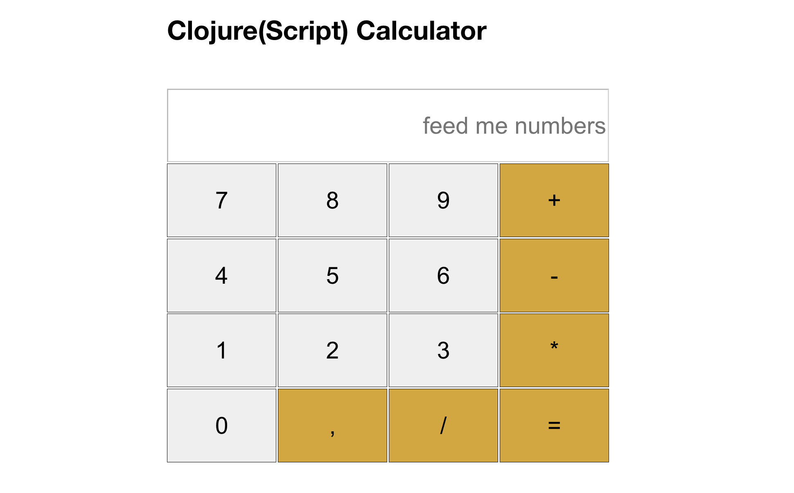
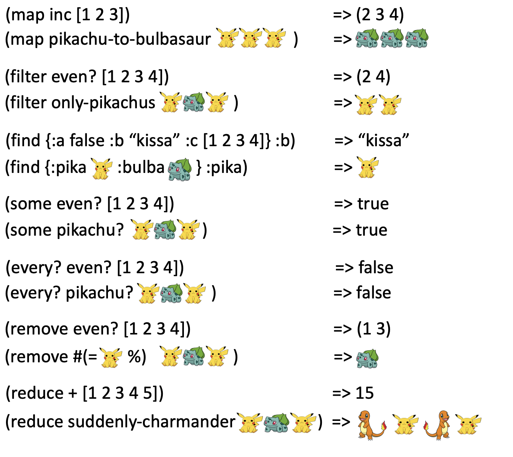

# Calculator application

This is a project for the [Twig The Code](https://twigthecode.com/) codecamp 2024! 
The repository offers the skeleton, and some tasks how to make the calculator better! :-) 




## How to get started?

1. Make sure you have the following installed:

- JDK 1.7 or newer, please have a newer
- Leiningen (https://leiningen.org/)
- Latest Node.js (https://nodejs.org/en/download/package-manager)

2. Do one of the following:

- Hardest path: Build everything yourself by starting from scratch. Create a new Leinigen project with `lein new reagent-frontend calculator-project` (https://github.com/reagent-project/reagent).
- Medium path: Fork this repository (branch "main") so you get the rough skeleton to add functions to.
- Easy path: Fork this repository (branch "add") so you get the number adding solution ready.

Note that there are no wrong or right solutions in making this work! :-)


## Development mode

1. Run  `npm install` 
2. Run  `npx shadow-cljs watch app`
3. Then connect your IDE to the ClojureScript REPL.

The application is designed to run in localhost:3001, to avoid possible conflicts with other local web applications which normally use port 3000. 
This is set in [shadow-cljs.edn](shadow-cljs.edn).

The main code to modify is in the [src/calculator/core.cljs](src/calculator/core.cljs) -namespace. This is where you start your journey and write the magic! :-)

## Structure

This base skeleton was created with Leiningen using the command above (lein new reagent-frontend twig-the-calculator), so we have most of the setup ready without any work.

Under "*public*" folder We have the following items:
- index.html that pretty much just loads the JavaScript we write. ("JavaScript?", you wonder? ClojureScript gets compiled into JavaScript!)
- Folder for our css-files, currently holding only one, "*site.css*".
- Folder for compiled JavaScript.

Under "*src*"-folder we have the source codes. Currently there are two files:
- user.clj, which was brought here when the application was initialized.
- core.cljs, which contains the code for the calculator.

## Documentation

This repository has a few docs to help you onward:

1. The very basics of Clojure syntax. Mostly ripped from [ClojureBridge (FI)](https://github.com/clojurebridgefi/clojurebridge-fi) documentation, this file is a good place to start: [basics.clj](basics.clj)

2. A list of work to do! Of course you don't need to follow this at all, you can just go and create your own flow. But this might be useful ;-) [TODO.md](TODO.md)

3. A helper namespace. Here I have tried to gather all the "calculator-specific" funtions and things, that aren't covered anywhere else: [helper.cljs](helper.cljs)

4. Finally, links. Here you can find more info about Clojure, where to learn more and where to meet like-minded Clojurists :-) Some links are useful with this project too! [links.md](links.md)

##

### Somewhat irrelevant image of explaining sequence transformations with Pokémon ;-D




## Building for production if you decide to go that far with this

```
npx shadow-cljs release app
```
